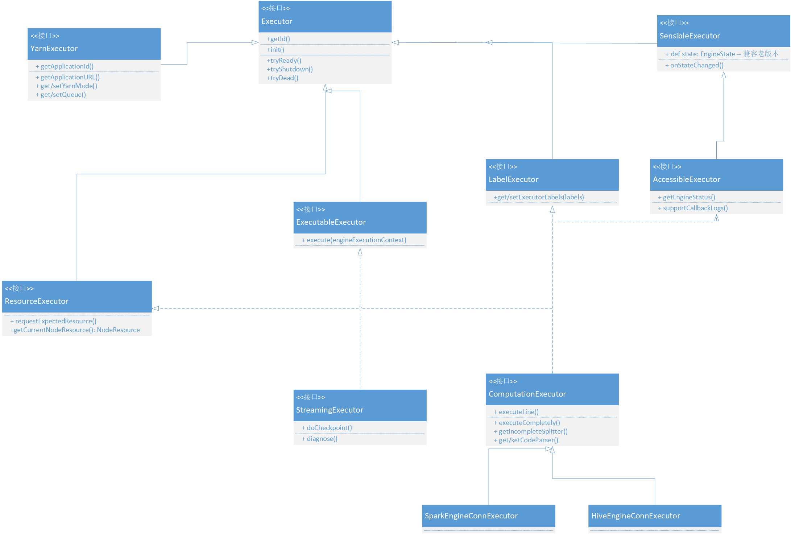

## Executor类图

Executor是对引擎各种能力的顶层抽象，每一种Executor会包含多种Service。Executor由用户实现的EngineFactory创建，其基类为Executor接口。**为了兼容老版本，**Executor**会做一定的适配工作**。

Executor作为基类，现在只提供最基础的init()、tryReady()、tryShutdown()、tryDead()方法。
根据用户的使用需要，现在将提供以下的派生Executor基类，其类名和主要作用如下：

1. SensibleExecutor

   a. Executor存在多种状态，允许Executor切换状态

   b. Executor切换状态后，允许做通知等操作

2. YarnExecutor

   指Yarn类型的引擎，能够获取得到applicationId和applicationURL和队列

3. ResourceExecutor

   指引擎具备资源动态变化的能力，配合提供requestExpectedResource方法，用于每次希望更改资源时，先向RM申请新的资源；而resourceUpdate方法，用于每次引擎实际使用资源发生变化时，向RM汇报资源情况。

4. AccessibleExecutor

   AccessibleEngine是一个非常重要的Executor基类。如果用户的Executor继承了该基类，则表示该Engine是可以被访问的。**这里需区分Sensible**Executor**的state()和Accessible**Executor**的getEngineStatus()方法：state()用于获取引擎状态，getEngineStatus()会获取引擎的状态、负载、并发等基础指标Metric数据。**

   同时，如果继承了AccessibleExecutor，会触发Engine进程实例化多个EngineReceiver方法。EngineReceiver用于处理Entrance、EM和LinkisMaster的RPC请求，使得该引擎变成了一个可被访问的引擎，用户如果有特殊的RPC需求，可以通过实现RPCService接口，进而实现与AccessibleExecutor通信。

5. ExecutableExecutor

   ExecutableExecutor是一个常驻型的Executor基类，常驻型的Executor包含：生产中心的Streaming应用、提交给Schedulis后指定要以独立模式运行的脚步、业务用户的业务应用等。

6. StreamingExecutor

   Streaming为流式应用，继承自ExecutableExecutor，需具备诊断、do checkpoint、采集作业信息、监控告警的能力。

7. ComputationExecutor是常用的交互式引擎Executor，处理交互式执行任务，并且具备状态查询、任务kill等交互式能力

以上为引擎部分的抽象接口，而实现具体的引擎，需要实现EngineConnPlugin中的EngineConnFactory接口。