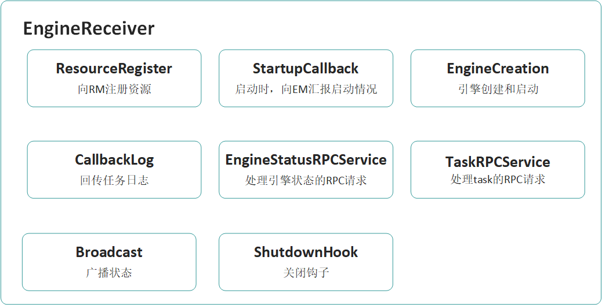
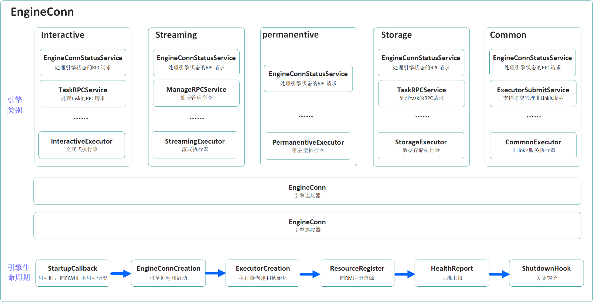

## 背景

**Linkis0.X Engine模块存在以下问题**

1. EngineReceiver过于集中

   Linkis0.X的主要能力，都集中体现在了EngineReceiver里面，如下图：

   
   由图可知，每一个Engine主要工作是启动一个Receiver监听，用于跟EngineManager和Entrance交互。该方法理解比较简单，但是糅合了较多的逻辑，不利于引擎功能的扩展。并且有些类型比如一次性引擎只跑一次性任务不需要Receiver跟Entrance通信，之前的架构也需要带上Receiver的逻辑。

2. Engine的类型划分过细，不便于统一管理

   Linkis 0.X要支持一种新的Engine，需要同时实现对应的Entrance接口、EngineManager接口和Engine接口，这样开发的工作量较高，且在多种引擎部署的应用环境下也会比较难以维护和统计。

3. 缺乏对新类型引擎的支持

   Linkis 0.X版本的Engine只支持交互式引擎，对于常驻型、一次性、流式引擎的兼容不够灵活，需要作出较大的且通用的改造才能适配，比如常驻式引擎启动后不需要加锁，一次性引擎启动后不支持Receiver和访问状态，这样在entrance和engine都需要增加适配以支持现有逻辑。

**Linkis1.0.0相比于Linkis0.X做了较大的改造，主要有以下几点**

1. 区分EngineConn和Executor。EngineConn定义为引擎连接器，用于创建一个底层计算存储引擎的连接会话Session；Executor作为真正的计算场景执行器，是实际的计算逻辑执行单元。

2. 将Executor的创建交由EngineConnPlugin实现，Engine启动后调用EngineConnPlugin的具体实现方法创建具体的Executor；

3. 拆分之前的EngineReceiver为多个Service，解耦Service和Listener。这些Service分散成多个exeuctor模块，由具体类型引擎根据需要自由选取；

4. 需要能够支持交互式、一次性、Streaming、存储等引擎方式。抽象之后各个引擎将统一由同一类别的EngineManager微服务启动，Entrance也只有一种类型。

5. Engine的内容定义拆分成EngineConn和Executor两部分，其中EngineConn是与具体引擎通信的client，Executor负责将用户代码提交给EngineConn。并且新的Engine中EngineConn部分不依赖Spring，Executor可以根据需要自行选择依赖Spring与否。

## 架构图

在Linkis1.0.0以后，由于AM与RM合并为LinkisManager，底层的引擎基础信息完全共享，所以Broadcast模块将会被去掉，而其他模块，将会从EngineReceiver中拆分出来成为独立的模块。

Linkis1.0.0的EngineReceiver将会更加纯粹，本身只会处理RPC请求，并且会根据Executor的类别不同，其RPCService也会不尽相同，将能满足全部的交互式、流式和常驻型的用户需求；甚至，Linkis1.0.0的Executor，将可满足业务用户的大数据业务系统开发需求。

**在对应Linkis 0.X的问题，分别有如下好处**

1. 避免Receiver耦合业务逻辑，本身只保留rpc通信功能。将Engine用到的能力比如加锁、访问状态、获取日志等等抽象成多个服务，并且分散在多个Executor模块中，这样不同类型引擎比如交互式引擎、流式引擎、一次性引擎可以根据需要分别加载其中需要的能力，大大减少引擎实现的冗余。
2. Linkis 1.0模块Engine将进行重构，并且所有引擎都将基于一种框架EngineConn+Executor进行实现，不同特性的引擎可以灵活采用需要的能力，并且将对Entrance和EngineManager统一成一种，通过不同标签来区分Engine，这样大大减少了增加新引擎的开发工作量，也减少了多引擎部署和运维的难度。
3. 新的架构考虑了多种格式的引擎，并且抽象成几大类引擎：交互式计算引擎、流式引擎、一次性引擎等等可能用到的，构建成统一的引擎框架，便于后期的扩充。