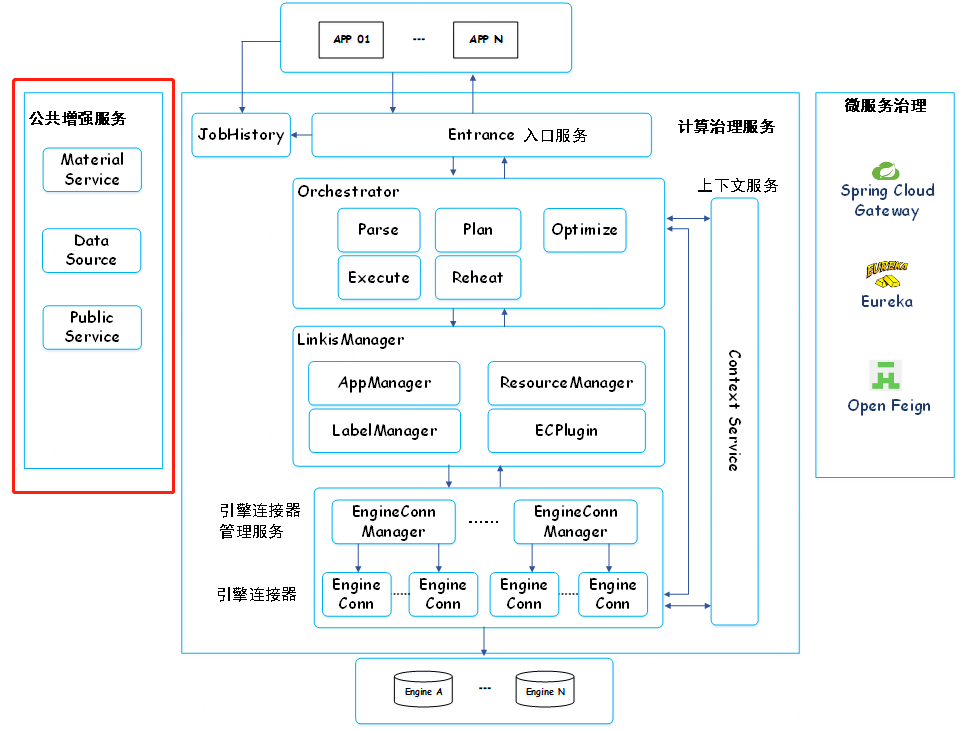

## **背景**

公共增强服务是Linkis的三大核心模块之一，主要包含了物料库服务、上下文服务、数据源服务和公共服务的内容。这些服务基本被其它各个模块所使用到，是专门抽取的公共服务。

## **架构图**

## **架构说明**

物料库服务：采用数据库来实现文件版本控制和服务无状态两大功能，用户的文件最终是存储在HDFS上面，一个文件的所有版本内容都存储在一个HDFS文件内。将所有的文件抽象成了资源，所以在表命名的时候会以资源为名进行叙述。

上下文服务：上下文服务主要应用在前后存在关联关系的计算任务中，独立运行的应用可以通过上下文服务获取到对方的运行结果，支持按关键字进行检索。支持直接通过ContextKey进行索引，完成对上下文信息的存储，通过ContextKey和ContextValue进行映射存储。

数据源服务：数据源服务主要包含了数据源管理服务和元数据查询，数据源管理服务作为独立的服务负责数据源的增删改查，只负责管理数据源。元数据查询服务根据不同的数据源单独成服务，减少一些复杂的依赖和版本的兼容问题，支持用户选择性安装某个元数据服务。

公共服务：PublicService公共服务是由configuration、jobhistory、udf、variable等多个子模块组成的综合性服务。Linkis
1.0在0.9版本的基础上还新增了标签管理。Linkis在用户不同作业执行过程中，不是每次执行都需要去设置一遍参数，很多可以复用的变量，函数，配置都是用户在完成一次设置后，能够被复用起来，当然还可以共享给别的用户使用。
